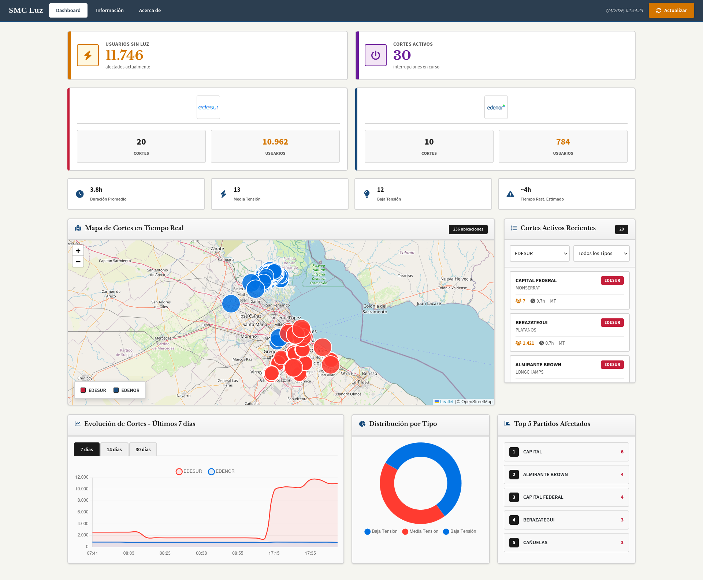
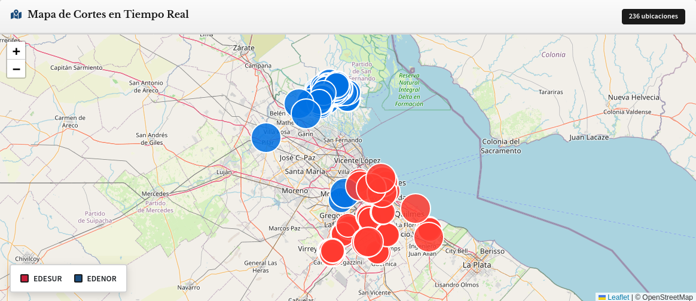
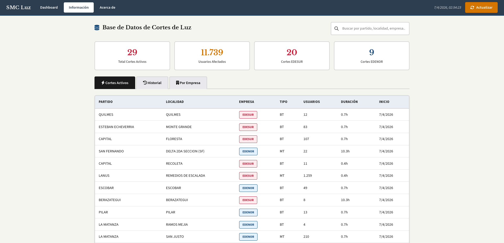
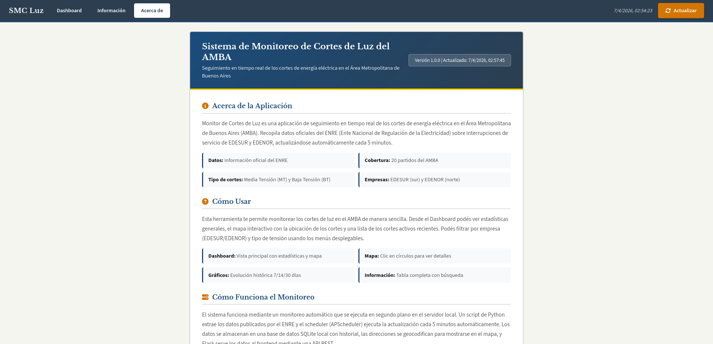

# Sistema de Monitoreo de Cortes de Luz del AMBA



Sistema de monitoreo en tiempo real de cortes de energía eléctrica en el Área Metropolitana de Buenos Aires (AMBA), basado en datos públicos del ENRE (Ente Nacional de Regulación de la Electricidad).

## Características

- **Actualización automática** cada 5 minutos de los datos oficiales del ENRE
- **Dashboard interactivo** con estadísticas en tiempo real:
  - KPIs: usuarios sin luz, cortes activos, duración promedio
  - Mapa interactivo con ubicación de cortes (Leaflet)
  - Gráficos de evolución temporal (7/14/30 días)
  - Top 5 partidos más afectados
  - Distribución por tipo de corte y empresa
- **Filtros** por empresa distribuidora (EDESUR/EDENOR) y tipo de tensión (MT/BT)
- **Base de datos SQLite** con historial de cortes
- **Diseño responsivo** compatible con móviles

## Capturas de Pantalla

### Dashboard Principal


### Mapa Interactivo


### Sección Información


### Acerca de


## Requisitos

- Python 3.10+
- pip

## Instalación

```bash
# 1. Clonar el repositorio
git clone https://github.com/LuigiValentino/smc-luz-amba.git
cd smc-luz-amba

# 2. Crear entorno virtual (recomendado)
python -m venv venv

# 3. Activar entorno virtual
# Linux/Mac:
source venv/bin/activate
# Windows:
venv\Scripts\activate

# 4. Instalar dependencias
pip install -r requirements.txt

# 5. Ejecutar la aplicación
python app.py
```

## Uso

1. Abrir http://localhost:5000 en el navegador
2. El scraping se ejecuta automáticamente cada 5 minutos
3. Hacer clic en "Actualizar" en el header para forzar un scrape manual

## Estructura del Proyecto

```
smc-luz-amba/
├── app.py                 # Aplicación Flask principal
├── models.py              # Modelos de base de datos (SQLAlchemy)
├── scraper.py             # Lógica de scraping del ENRE
├── geocoder.py            # Geocodificación de zonas
├── scheduler.py           # Programador APScheduler
├── requirements.txt       # Dependencias Python
├── README.md              # Este archivo
├── templates/
│   └── dashboard.html     # Dashboard HTML completo
├── static/
│   ├── css/
│   │   └── style.css     # Estilos CSS
│   └── images/
│       ├── edesur.png    # Logo EDESUR
│       ├── edenor.png    # Logo EDENOR
│       └── arcynox.png   # Logo Arcynox
└── data/
    └── cortes.db         # Base de datos SQLite
```

## API Endpoints

| Método | Ruta | Descripción |
|--------|------|-------------|
| GET | `/` | Dashboard HTML |
| POST | `/api/scrape` | Forzar scrape manual |
| GET | `/api/estadisticas` | Estadísticas generales |
| GET | `/api/cortes` | Lista de cortes (soporta filtros: empresa, tipo, partido) |
| GET | `/api/mapa` | Datos GeoJSON para el mapa |
| GET | `/api/evolucion?dias=7` | Evolución temporal (días: 7, 14, 30) |
| GET | `/api/ranking_partidos` | Ranking de partidos más afectados |

## Tecnologías Utilizadas

- **Backend**: Python, Flask, SQLite, APScheduler
- **Frontend**: HTML, CSS, JavaScript
- **Mapas**: Leaflet
- **Gráficos**: Chart.js
- **Estilos**: CSS personalizado 

## Fuentes de Datos

Los datos se obtienen automáticamente de las fuentes oficiales del ENRE:
- EDESUR: https://www.enre.gov.ar/paginacorte/js/data_EDS.js
- EDENOR: https://www.enre.gov.ar/paginacorte/js/data_EDN.js

## Disclaimer

Esta aplicación es de carácter informativo y educativo. Los datos son recopilados automáticamente del ENRE y pueden presentar demora respecto a los informados oficialmente. No tiene vinculación con las empresas distribuidoras EDESUR ni EDENOR.

## Desarrollador

**App desarrollada por Luigi Adducci**

¿Necesitás un sistema a medida para monitoreo de cortes, alertas automáticas, notificaciones por email o WhatsApp? Contactanos:

-  Luigiadduccidev@gmail.com
-  arcynox.software@gmail.com
-  GitHub: https://github.com/LuigiValentino

**Arcynox** - Desarrollo de Software a Medida

## Licencia

Este proyecto es de uso libre para fines educativos e informativos.